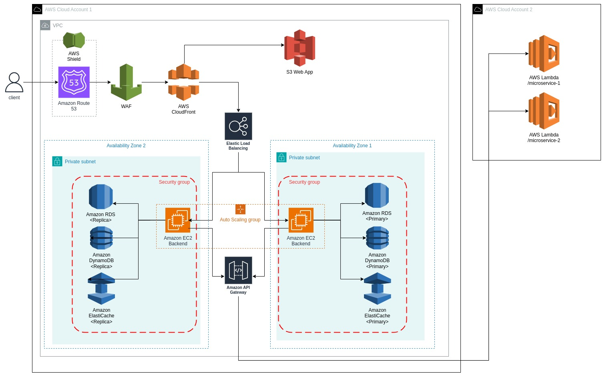

## Craftech 2025 Prueba 1 - Diagrama de Red:
Produzca un diagrama de red (puede utilizar lucidchart) de una aplicación web en Google Cloud Platform (GCP) o Amazon Web Services (AWS) y escriba una descripción de texto de 1/2 a 1 página de sus elecciones y arquitectura.

**El diseño debe soportar**:
- Cargas variables
- Contar con HA (alta disponibilidad)
- Frontend en Js
- Backend con una base de datos relacional y una no relacional
- La aplicación backend consume 2 microservicios externos
El diagrama debe hacer un mejor uso de las soluciones distribuidas.

  

### Descripcion de la Arquitectura:
Suponiendo que nuestra Web App es un portal de noticias de Craftech, se utilizó el servicio **Route 53** para la configuración del dominio, por ejemplo **www.newsCraftech.org**. El frontend se almacena como una web estática (guardando en un bucket de **S3**, archivos JavaScript/CSS/HTML). El flujo de peticiones pasa por **Amazon CloudFront**, el cual actúa como una CDN (Content Delivery Network) distribuyendo el contenido a nivel global. Por otro lado para los accesos al backend se utilizó **Elastic Compute Cloud (EC2)**. Dentro de la Zona de Disponibilidad 1, están las instancias primarias de la base de datos relacional en **Amazon RDS** (por ejemplo, PostgreSQL) para almacenar la información como artículos, usuarios, etc. Además, se utiliza **Amazon DynamoDB** para datos no relacionales (por ejemplo para documentos claves-valor). Adicionalmente se agrega el servicio **Amazon ElastiCache** (Redis o Memcached) para caché de consultas frecuentes y mejorar asi la performance.

En la arquitectura se implementaron dos AZ, el trafico es gestionado por el servicio **Elastic Load Balancer (ELB)**, las instancias EC2 se encuentran configuradas con el **Auto Scaling Group** para ajustar automaticamente la cantidad de instancias EC2 segun la demanda pudiendo asi trabajar bajo **cargas variables** y evitando costos innecesarios a bajo trafico, es recomendable que se limite este ajuste automatico.

Para garantizar **alta disponibilidad**, se configuró otra AZ con replicas en multi-AZ para la base de datos relacional y se habilitó la sincronización de datos, por lo tanto si la AZ primaria falla, la aplicación puede continuar funcionando desde la AZ secundaria, el failover de la base de datos lo gestiona automáticamente el servicio de RDS conmutando automaticamente. 

Se ha configurado API Gateway para exponer y consumir microservicios externos (por ejemplo, servicios en AWS Lambda o de terceros).

Finalmente, en cuanto a la seguridad, se incorporan **AWS Shield** para proteger contra ataques DDoS y **AWS WAF** (Web Application Firewall) para filtrar patrones de tráfico malicioso, bloqueando ataques como inyecciones de SQL o XSS, manteniendo así la integridad y disponibilidad de la aplicación.