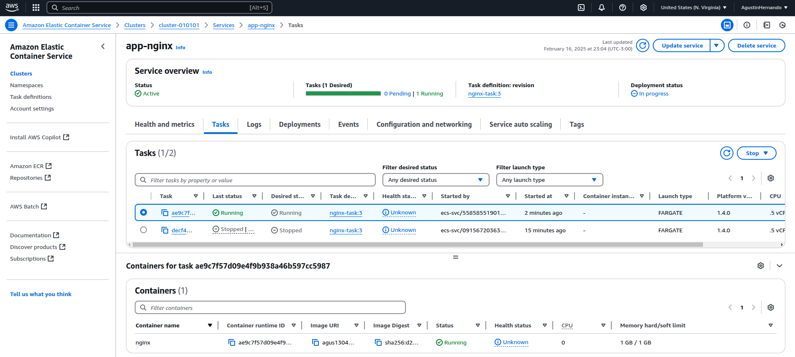
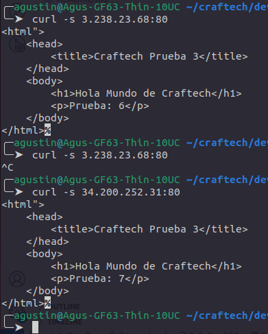

## Craftech 2025 Prueba 3 - CI/CD 
Dockerizar un nginx con el index.html default.kw Elaborar un pipeline que ante cada cambio realizado sobre el index.html buildee la nueva imagen y la actualize en la plataforma elegida. (docker-compose, swarm, kuberenetes, etc.) Para la creacion del CI/CD se puede utilizar cualquier plataforma (CircleCI, Gitlab, Github, Bitbucket.)

Requisitos y deseables:
La solución al ejercicio debe mostrarnos que usted puede:
Automatizar la parte del proceso de despliegue. usar conceptos de CI para aprovisionar el software necesario para que los entregables se ejecuten use cualquier herramienta de CI de su elección para implementar el entregable

### Descripcion
- Se generó el siguiente Dockerfile:
```bash
FROM nginx:1.22

WORKDIR /usr/share/nginx/html

COPY index.html index.html
``` 

La linea **COPY index.html index.html** lo que hace es sobreescribir el index.html original de la imagen nginx:1.22
- El archivo index.html solo contiene un mensaje y un contador:
```html
<html">
    <head>
        <title>Craftech Prueba 3</title>
    </head>
    <body>
        <h1>Hola Mundo de Craftech</h1>
        <p>Prueba: 6</p>
    </body>
</html>
``` 

La imagen Docker solo se requiere su reconstruccion si este archivo es modificado, esto se ha configurado en un GithubActions:

```yml
name: GitHub Actions Demo
run-name: ${{ github.actor }} is testing out GitHub Actions 🚀
on: 
  push:
    branches:
      - main # Se ejecuta solo en cambios sobre la rama main
    paths:
      - prueba-3/index.html # si este archivo cambia
env:
  AWS_REGION: us-east-1
  ECS_SERVICE: app-nginx
  ECS_CLUSTER: cluster-010101
  ECS_TASK_DEFINITION: nginx-task 
jobs:
  deploy:
    name: deploy to cluster 
    runs-on: ubuntu-latest # VM
    steps:
    -
      name: Checkout
      uses: actions/checkout@v4
    -
      name: Login to Docker Hub
      uses: docker/login-action@v3
      with:
        username: ${{ secrets.DOCKER_USERNAME }}
        password: ${{ secrets.DOCKER_PASSWORD }}
    -
      name: Set up Docker Buildx
      uses: docker/setup-buildx-action@v3
    - 
      name: build and push to docker
      uses: docker/build-push-action@v6
      with:
        context: prueba-3
        push: true
        tags: ${{ secrets.DOCKER_REPOSITORY }}:latest
    - 
      name: Configure AWS credentials
      uses: aws-actions/configure-aws-credentials@v1
      with:
        aws-access-key-id: ${{ secrets.AWS_ACCESS_KEY_ID }}
        aws-secret-access-key: ${{ secrets.AWS_SECRET_ACCESS_KEY }}
        aws-region: ${{ env.AWS_REGION }}
    -
      name: Update ECS
      run: |
        aws ecs update-service \
          --cluster  ${{ env.ECS_CLUSTER }} \
          --service ${{ env.ECS_SERVICE }} \
          --force-new-deployment
```

### Explicación rápida  
- **Este workflow se activa solo cuando se hace un push a `main` y afecta `prueba-3/index.html`**.  
- **Construye y sube una imagen Docker a Docker Hub**.  
- **Configura credenciales de AWS y actualiza un servicio ECS para desplegar la nueva imagen**.  

### Requisitos  
- **Guardar las credenciales en GitHub Secrets**:  
  - `DOCKER_USERNAME` y `DOCKER_PASSWORD` para Docker Hub.  
  - `AWS_ACCESS_KEY_ID` y `AWS_SECRET_ACCESS_KEY` para AWS.  
  - `DOCKER_REPOSITORY` con el nombre del repo de Docker Hub.  
- Por otro lado necesitamos configurar nuestro servicio en un cluster ECS para que corra en un contenedor nuestra task la cual tendra configurada nuestra imagen.
- Es importante configurar correctamente los security groups para que la instancia de contenedor pueda acceder a internet y descargar la imagen (Outbound rules) y tambien que pueda ser accedido desde internet en el puerto 80 mediante HTTP (Inbound rules.)

### Testing
```bash
╭─agustin@Agus-GF63-Thin-10UC ~/craftech/devops-interview-ultimate-resolution/prueba-3  ‹main› 
╰─➤  curl -s 3.238.23.68:80            
<html">
    <head>
        <title>Craftech Prueba 3</title>
    </head>
    <body>
        <h1>Hola Mundo de Craftech</h1>
        <p>Prueba: 6</p>
    </body>
</html>%
```
<p align="center">
  
</p>

<p align="center">
  
</p>

Se puede observar como el actions fuerza un nuevo deploy, cuando este finaliza el contenedor viejo es frenado y se pone en produccion uno nuevo con la imagen actualizada, modificando tambien la ip-public.


### Enlaces Útiles
- [build-push-action](https://github.com/docker/build-push-action?tab=readme-ov-file#path-context)
- [Desplegar hacia Amazon Elastic Container Service](https://docs.github.com/es/enterprise-cloud@latest/actions/use-cases-and-examples/deploying/deploying-to-amazon-elastic-container-service)